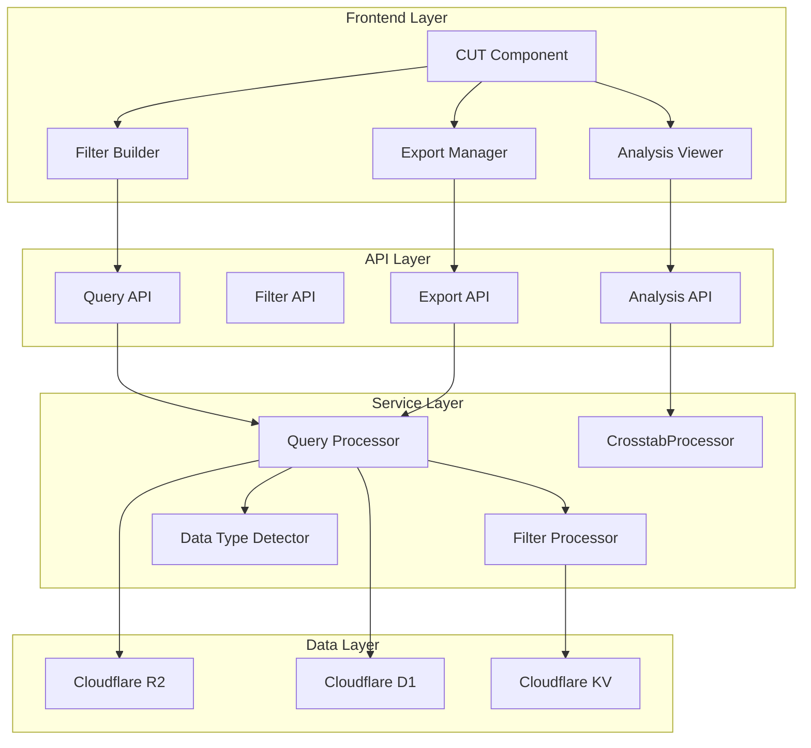

# Design Document

## Overview

The CUT (Cutty Ultimate Tool) dynamic query builder is a comprehensive data analysis interface that extends Cutty's existing CSV processing capabilities. The system builds upon the current architecture, leveraging the existing CrosstabProcessor service, file management system, and React frontend components. The design emphasizes performance, usability, and seamless integration with the existing Cutty ecosystem.

The tool transforms the current static filter approach into a dynamic, interactive query builder with manual-controlled analysis capabilities, intelligent data type detection, and advanced export functionality.

## Architecture

### High-Level Architecture



### Component Integration

The CUT system integrates with existing Cutty components:

- **File Management**: Leverages existing file upload, storage, and metadata systems
- **Authentication**: Uses current JWT-based authentication and user context
- **CSV Processing**: Extends the CrosstabProcessor for advanced filtering and analysis
- **UI Framework**: Built with Material-UI components matching existing design patterns

## Components and Interfaces

### Frontend Components

#### CUT Main Component (`CuttytabsQueryBuilder.jsx`)

The primary interface component that orchestrates the entire query building experience.

```typescript
interface CUTProps {
  fileId?: string;
  initialData?: CSVData;
  onExport?: (data: FilteredData) => void;
}

interface CUTState {
  selectedFile: FileMetadata | null;
  columns: ColumnMetadata[];
  filters: FilterConfiguration[];
  analysisConfig: AnalysisConfiguration;
  previewData: PreviewData | null;
  isLoading: boolean;
  error: string | null;
}
```

**Key Features:**
- File selection dropdown (integrates with existing file management)
- Column display with data type indicators
- Manual filter management with "Apply Filters" button
- Analysis configuration panel
- Export controls with "CUT IT" button

#### Filter Builder Component (`FilterBuilder.jsx`)

Handles dynamic filter creation and management based on column data types.

```typescript
interface FilterBuilderProps {
  columns: ColumnMetadata[];
  filters: FilterConfiguration[];
  onFiltersChange: (filters: FilterConfiguration[]) => void;
  onPreviewUpdate: () => void;
}

interface FilterConfiguration {
  id: string;
  columnName: string;
  dataType: DataType;
  operator: FilterOperator;
  value: FilterValue;
  logicalOperator?: 'AND' | 'OR';
}
```

**Data Type Specific Filters:**
- **Text**: Contains, Equals, Starts With, Ends With, Regex, In List
- **Number**: Equals, Greater Than, Less Than, Between, In Range
- **Date**: Date Range, Before/After, Relative Dates (Last 30 days, This month)
- **Boolean**: True/False/Null options

#### Analysis Viewer Component (`AnalysisViewer.jsx`)

Displays analysis results including crosstabs and summary statistics after filters are applied.

```typescript
interface AnalysisViewerProps {
  data: FilteredData;
  analysisConfig: AnalysisConfiguration;
  onConfigChange: (config: AnalysisConfiguration) => void;
  onRecalculate: () => void;
}

interface AnalysisConfiguration {
  type: 'crosstab' | 'summary' | 'frequency';
  rowVariable?: string;
  columnVariable?: string;
  showPercentages: boolean;
  displayMode: 'total' | 'row' | 'column';
}
```

**Analysis Types:**
- **Crosstabs**: Leverages existing CuttytabsTable component
- **Summary Statistics**: Count, unique values, nulls per column
- **Frequency Counts**: Single variable frequency analysis

#### Export Manager Component (`ExportManager.jsx`)

Handles data export with metadata preservation and file management integration.

```typescript
interface ExportManagerProps {
  filteredData: FilteredData;
  filters: FilterConfiguration[];
  onExport: (config: ExportConfiguration) => void;
}

interface ExportConfiguration {
  filename: string;
  includeMetadata: boolean;
  format: 'csv' | 'json';
  saveToFiles: boolean;
}
```

### Backend Services

#### Query Processor Service (`query-processor.ts`)

New service that handles dynamic query building and execution.

```typescript
class QueryProcessor {
  static async executeQuery(
    csvContent: string,
    filters: FilterConfiguration[]
  ): Promise<FilteredData>;
  
  static async getPreviewData(
    csvContent: string,
    filters: FilterConfiguration[],
    limit: number = 100
  ): Promise<PreviewData>;
  
  static async validateFilters(
    columns: ColumnMetadata[],
    filters: FilterConfiguration[]
  ): Promise<ValidationResult>;
}
```

#### Data Type Detector Service (`data-type-detector.ts`)

Intelligent data type detection for columns.

```typescript
class DataTypeDetector {
  static detectColumnTypes(csvContent: string): ColumnMetadata[];
  static inferDataType(values: string[]): DataType;
  static validateDataType(value: string, type: DataType): boolean;
}

enum DataType {
  TEXT = 'text',
  NUMBER = 'number',
  DATE = 'date',
  BOOLEAN = 'boolean',
  MIXED = 'mixed'
}
```

#### Filter Processor Service (`filter-processor.ts`)

Handles filter application and SQL-like query generation.

```typescript
class FilterProcessor {
  static applyFilters(
    data: CSVRow[],
    filters: FilterConfiguration[]
  ): CSVRow[];
  
  static generateFilterSQL(filters: FilterConfiguration[]): string;
  static optimizeFilters(filters: FilterConfiguration[]): FilterConfiguration[];
}
```

### API Endpoints

#### Query Builder Endpoints

```typescript
// Get column metadata with data types
GET /api/v1/files/:fileId/columns
Response: {
  success: boolean;
  columns: ColumnMetadata[];
  rowCount: number;
}

// Execute query with filters
POST /api/v1/files/:fileId/query
Request: {
  filters: FilterConfiguration[];
  limit?: number;
  offset?: number;
}
Response: {
  success: boolean;
  data: FilteredData;
  totalRows: number;
}

// Get analysis results
POST /api/v1/files/:fileId/analyze
Request: {
  filters: FilterConfiguration[];
  analysisConfig: AnalysisConfiguration;
}
Response: {
  success: boolean;
  analysis: AnalysisResult;
}

// Export filtered data
POST /api/v1/files/:fileId/export-filtered
Request: {
  filters: FilterConfiguration[];
  exportConfig: ExportConfiguration;
}
Response: {
  success: boolean;
  fileId: string;
  downloadUrl: string;
}
```

#### Filter Management Endpoints

```typescript
// Save filter configuration
POST /api/v1/filters/save
Request: {
  name: string;
  description: string;
  filters: FilterConfiguration[];
}

// Load saved filters
GET /api/v1/filters
Response: {
  success: boolean;
  savedFilters: SavedFilter[];
}

// Apply saved filter
POST /api/v1/filters/:filterId/apply
Request: {
  fileId: string;
}
```

## Data Models

### Core Data Structures

```typescript
interface ColumnMetadata {
  name: string;
  dataType: DataType;
  uniqueValues: number;
  nullCount: number;
  sampleValues: string[];
  statistics?: ColumnStatistics;
}

interface ColumnStatistics {
  min?: number | Date;
  max?: number | Date;
  mean?: number;
  median?: number;
  mode?: string | number;
}

interface FilteredData {
  rows: CSVRow[];
  totalRows: number;
  filteredRows: number;
  columns: ColumnMetadata[];
  appliedFilters: FilterConfiguration[];
}

interface PreviewData {
  rows: CSVRow[];
  totalRows: number;
  isComplete: boolean;
  sampleSize: number;
}

interface SavedFilter {
  id: string;
  name: string;
  description: string;
  filters: FilterConfiguration[];
  createdAt: Date;
  updatedAt: Date;
}
```

### Database Schema Extensions

```sql
-- Filter configurations table
CREATE TABLE filter_configurations (
  id TEXT PRIMARY KEY,
  user_id TEXT NOT NULL,
  name TEXT NOT NULL,
  description TEXT,
  filters TEXT NOT NULL, -- JSON serialized FilterConfiguration[]
  created_at DATETIME DEFAULT CURRENT_TIMESTAMP,
  updated_at DATETIME DEFAULT CURRENT_TIMESTAMP,
  FOREIGN KEY (user_id) REFERENCES users(id)
);

-- Query execution cache
CREATE TABLE query_cache (
  id TEXT PRIMARY KEY,
  file_id TEXT NOT NULL,
  filters_hash TEXT NOT NULL,
  result_data TEXT NOT NULL, -- JSON serialized result
  created_at DATETIME DEFAULT CURRENT_TIMESTAMP,
  expires_at DATETIME NOT NULL,
  FOREIGN KEY (file_id) REFERENCES files(id)
);

-- Column metadata cache
CREATE TABLE column_metadata (
  id TEXT PRIMARY KEY,
  file_id TEXT NOT NULL,
  column_name TEXT NOT NULL,
  data_type TEXT NOT NULL,
  metadata TEXT NOT NULL, -- JSON serialized ColumnMetadata
  created_at DATETIME DEFAULT CURRENT_TIMESTAMP,
  FOREIGN KEY (file_id) REFERENCES files(id)
);
```

## Error Handling

### Error Categories

1. **Validation Errors**: Invalid filter configurations, incompatible data types
2. **Performance Errors**: File too large, query timeout, memory limits
3. **Data Errors**: Malformed CSV, missing columns, encoding issues
4. **System Errors**: Database failures, R2 storage issues, authentication problems

### Error Handling Strategy

```typescript
interface CUTError {
  code: string;
  message: string;
  details?: any;
  recoverable: boolean;
}

class CUTErrorHandler {
  static handleFilterError(error: FilterError): CUTError;
  static handlePerformanceError(error: PerformanceError): CUTError;
  static handleDataError(error: DataError): CUTError;
  static handleSystemError(error: SystemError): CUTError;
}
```

### User-Friendly Error Messages

- **Filter Errors**: "The filter for column 'Age' expects a number, but 'abc' was provided"
- **Performance Errors**: "Processing large dataset. Please wait while filters are applied."
- **Data Errors**: "Column 'Date' contains invalid date formats. Some rows may be excluded"

## Performance Considerations

### Frontend Optimization

- **Virtual Scrolling**: For large datasets in preview tables
- **Manual Updates**: Prevent excessive API calls with explicit "Apply Filters" action
- **Memoization**: Cache expensive calculations and renders
- **Lazy Loading**: Load analysis components only when needed

### Backend Optimization

- **Query Caching**: Cache filter results for repeated queries
- **Streaming Processing**: Process large files in chunks
- **Index Optimization**: Create efficient database indexes for metadata
- **Connection Pooling**: Optimize database connection usage

### Manual Update Strategy

All file sizes use manual "Apply Filters" button for predictable performance and user control. This eliminates complexity around different update strategies and provides a consistent user experience regardless of dataset size.

This design provides a comprehensive foundation for the CUT dynamic query builder while maintaining compatibility with Cutty's existing architecture and performance requirements.