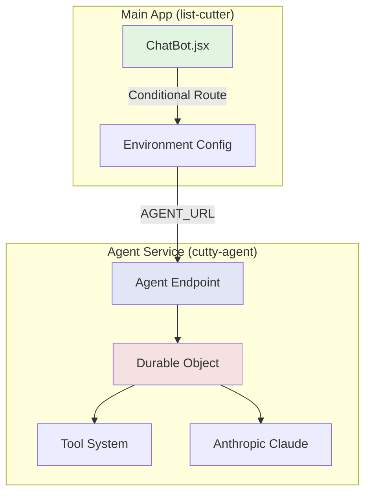

# Design Document

## Overview

Cutty Agent is a proof of concept that validates Cloudflare Agents as a replacement for the current Workers AI chatbot. Built as a separate service in its own repository, it provides a minimal implementation to test technical feasibility and integration patterns before committing to a full migration.

## Architecture



### Key Architectural Decisions
- **Separate Repository**: Complete isolation from production code
- **Durable Objects**: Stateful agent instances with built-in persistence
- **Streaming Responses**: Real-time interaction using Server-Sent Events
- **Single Tool**: Minimal implementation with getSupportedStates only

## Components

### Agent Repository Structure
```
cutty-agent/
├── src/
│   ├── server.ts      # Main agent class (~150 lines)
│   ├── tools.ts       # Tool definitions (~50 lines)
│   └── middleware.ts  # CORS handling (~30 lines)
├── wrangler.jsonc     # Cloudflare config
├── package.json       # Dependencies
└── README.md         # Integration guide
```

### Main App Integration
- **Location**: `app/frontend/src/components/ChatBot.jsx`
- **Changes**: 3 lines for conditional endpoint
- **Config**: Environment variables only

## Implementation

### Agent Configuration (wrangler.jsonc)
```jsonc
{
  "name": "cutty-agent",
  "main": "src/server.ts",
  "compatibility_date": "2025-01-07",
  
  "durable_objects": {
    "bindings": [{
      "name": "AGENT",
      "class_name": "CuttyAgent",
      "script_name": "cutty-agent"
    }]
  },

  // No separate environments for PoC
  // Just deploy to cutty-agent
}
```

### Tool Definition (tools.ts)
```typescript
import { tool } from 'agents';
import { z } from 'zod';

export const getSupportedStates = tool({
  description: 'Get list of supported US states',
  parameters: z.object({}),
  execute: async () => ({
    states: ['CA', 'FL', 'GA', 'IL', 'NY', 'OH', 'PA', 'TX'],
    message: 'I support 8 US states for data generation'
  })
});
```

### Agent Implementation (server.ts)
```typescript
import { Agent, AgentNamespace } from 'agents';
import { streamText } from 'ai';
import { anthropic } from '@ai-sdk/anthropic';
import { getSupportedStates } from './tools';

export class CuttyAgent extends Agent {
  async chat(request: Request): Promise<Response> {
    const { message } = await request.json();
    
    const result = await streamText({
      model: anthropic('claude-3-5-sonnet-20241022'),
      system: 'You are Cutty the Cuttlefish...',
      messages: [{ role: 'user', content: message }],
      tools: { getSupportedStates },
    });

    return new Response(result.toDataStream(), {
      headers: {
        'Content-Type': 'text/event-stream',
        'Access-Control-Allow-Origin': '*',
      },
    });
  }
}

export const CuttyAgentNamespace = AgentNamespace(CuttyAgent);
```

### Frontend Integration (ChatBot.jsx)
```javascript
// Only change needed in main app
const chatEndpoint = import.meta.env.VITE_AGENT_ENABLED === 'true'
  ? `${import.meta.env.VITE_AGENT_URL}/chat`
  : '/api/v1/chat';
```

## API Integration

### Endpoints
- `GET /health` - Health check returning status
- `POST /chat` - Main chat endpoint (streaming)
- `OPTIONS /*` - CORS preflight handling

### Request Format
```typescript
interface ChatRequest {
  message: string;
  sessionId?: string; // Optional for PoC
}
```

### Response Format
Server-Sent Events stream with:
- Text responses
- Tool execution results
- Completion signals

## Security Considerations

### CORS Configuration
- Explicitly allow Cutty domains
- Support localhost for development
- Credentials not required for PoC

### Authentication (Future)
- JWT token pass-through ready
- User context optional for PoC
- No data persistence in PoC

## Testing Strategy

### Week 1: Infrastructure
1. Deploy agent to Cloudflare (2 hours)
2. Verify Durable Objects work (1 hour)
3. Test health endpoint (30 min)

### Week 2: Integration
1. Add environment variables (30 min)
2. Update ChatBot component (1 hour)
3. Test CORS configuration (2 hours)
4. Verify streaming works (2 hours)

### Week 3: Validation
1. Implement getSupportedStates (1 hour)
2. Test tool execution (2 hours)
3. Document findings (4 hours)
4. Performance testing (2 hours)

## Deployment

### Agent Deployment
```bash
# From cutty-agent repo
npm run deploy
# Creates: https://cutty-agent.emily-cogsdill.workers.dev
```

### Main App Configuration
```env
# .dev.vars for local development
AGENT_ENABLED=true
AGENT_URL=http://localhost:8789

# For testing with deployed agent
AGENT_URL=https://cutty-agent.emily-cogsdill.workers.dev
```

## Success Metrics

- Agent uptime: 99%+ over 24 hours
- Response time: <2s for first byte
- Tool execution: 100% success rate
- Zero impact on existing chatbot
- Clean separation maintained

## Future Considerations

### If PoC Succeeds
1. Add more tools incrementally
2. Implement user authentication
3. Add conversation persistence
4. Create confirmation UI components

### If PoC Fails
1. Document specific blockers
2. Consider alternative architectures
3. Improve Workers AI implementation
4. No cleanup needed (separate repo)

## Implementation Notes

- Total new code: ~250 lines
- Main app changes: <10 lines
- No database required
- No file storage needed
- Completely reversible