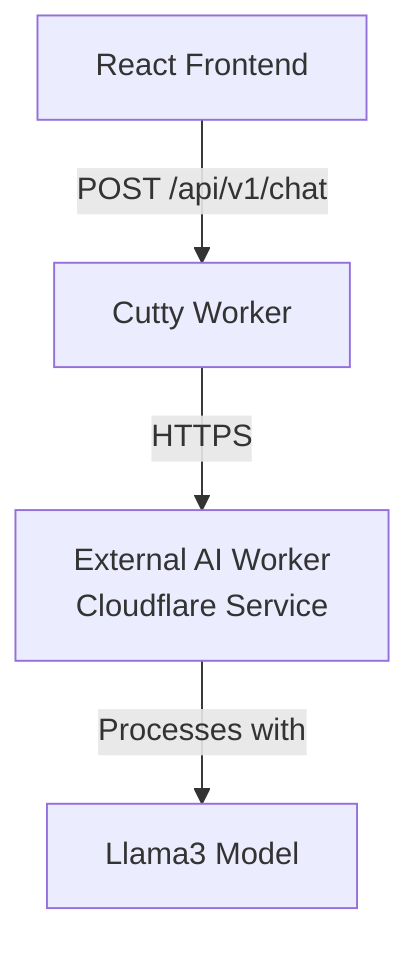

# Design Document - Simplified

## Overview

The Cutty Chatbot feature introduces "Cutty the Cuttlefish," an AI-powered assistant that helps users navigate the Cutty app. This simplified design leverages a cross-project architecture where the main Cutty app communicates with an existing Cloudflare AI worker while maintaining minimal complexity.

## Architecture

### Simplified Architecture



### Key Simplifications
- **External AI worker** - Leverages existing AI service
- **Single API endpoint** - Just POST /api/v1/chat
- **Minimal state management** - React component state only
- **No persistent storage** - Messages exist only in UI session
- **Simple authentication** - Basic API key for worker-to-worker communication

## Components

### Frontend

#### ChatBot Component
- **Location**: `app/frontend/src/components/ChatBot.jsx`
- **Purpose**: Complete chat interface
- **Size**: ~150-200 lines
- **Features**:
  - Floating chat button with expand/collapse
  - Message display area
  - Input field with send button
  - Loading indicator
  - Basic error display

### Backend

#### Chat Route
- **Location**: Add to existing `cloudflare/workers/src/routes/auth.ts` or create minimal `chat.ts`
- **Endpoint**: `POST /api/v1/chat`
- **Size**: ~50-100 lines
- **Features**:
  - Receive message
  - Call AI with system prompt
  - Return response
  - Basic error handling

## Data Models

### Minimal Message Format
```typescript
// Request
{
  message: string;
}

// Response  
{
  response: string;
  error?: string;
}

// Frontend State
interface Message {
  id: string;
  role: 'user' | 'assistant';
  content: string;
}
```

## Implementation

### Backend Implementation (Complete)
```typescript
// In routes/chat.ts
import { Hono } from 'hono';

const chatRoutes = new Hono();

const SYSTEM_PROMPT = `You are Cutty the Cuttlefish, a helpful assistant for the Cutty app.
The app helps users generate synthetic person data, filter by US states, and download CSV files.
Be friendly and enthusiastic. You're a playful cuttlefish character.
Focus on the synthetic data generation features.`;

chatRoutes.post('/', async (c) => {
  try {
    const { message } = await c.req.json();
    
    if (!message || typeof message !== 'string') {
      return c.json({ error: 'Message is required' }, 400);
    }
    
    if (message.length > 4000) {
      return c.json({ error: 'Message too long (max 4000 characters)' }, 400);
    }

    // Call external AI worker with correct API format
    const aiResponse = await fetch(`${c.env.AI_WORKER_URL}/api/v1/chat`, {
      method: 'POST',
      headers: {
        'Content-Type': 'application/json',
        'Authorization': `Bearer ${c.env.AI_WORKER_API_KEY}`
      },
      body: JSON.stringify({
        message: message,
        systemPrompt: SYSTEM_PROMPT
      })
    });

    if (!aiResponse.ok) {
      throw new Error('AI service unavailable');
    }

    const data = await aiResponse.json();
    return c.json({ response: data.response });
  } catch (error) {
    console.error('Chat error:', error);
    return c.json({ 
      error: 'Sorry, I encountered an error. Please try again.' 
    }, 500);
  }
});

export default chatRoutes;
```

### Frontend Implementation (Key Parts)
```jsx
// ChatBot.jsx skeleton
const ChatBot = () => {
  const [isOpen, setIsOpen] = useState(false);
  const [messages, setMessages] = useState([]);
  const [input, setInput] = useState('');
  const [loading, setLoading] = useState(false);

  const sendMessage = async () => {
    if (!input.trim()) return;
    
    const userMessage = { id: Date.now(), role: 'user', content: input };
    setMessages(prev => [...prev, userMessage]);
    setInput('');
    setLoading(true);

    try {
      const response = await fetch('/api/v1/chat', {
        method: 'POST',
        headers: { 'Content-Type': 'application/json' },
        body: JSON.stringify({ message: input })
      });
      
      const data = await response.json();
      
      if (data.error) {
        throw new Error(data.error);
      }
      
      setMessages(prev => [...prev, {
        id: Date.now() + 1,
        role: 'assistant',
        content: data.response
      }]);
    } catch (error) {
      setMessages(prev => [...prev, {
        id: Date.now() + 1,
        role: 'assistant',
        content: 'Sorry, I encountered an error. Please try again.'
      }]);
    } finally {
      setLoading(false);
    }
  };

  // Render UI...
};
```

## Configuration

### Environment Variables
```toml
# In wrangler.toml
[vars]
AI_WORKER_URL = "https://ai.emilycogsdill.com"

# In .dev.vars (for local development)
AI_WORKER_API_KEY = "your-api-key-here"
```

### Wrangler Secrets
```bash
# Production secret
wrangler secret put AI_WORKER_API_KEY
```

## API Integration Details

### External AI Worker API
The AI worker at `https://ai.emilycogsdill.com` provides:
- **Endpoint**: `/api/v1/chat`
- **Authentication**: Bearer token in Authorization header
- **Rate Limit**: 100 requests/hour per API key
- **Max Message Length**: 4000 characters
- **Response Format**: `{ response: string }`
- **Error Format**: `{ error: string }`

### Request/Response Flow
1. User sends message to Cutty backend
2. Backend validates input (length, type)
3. Backend calls AI worker with message + systemPrompt
4. AI worker returns response or error
5. Backend forwards response to frontend
6. Frontend displays in chat UI

## Security Considerations

### Simple Security
- Rate limiting on the chat endpoint (inherit from AI worker limits)
- Input validation (message length max 4000 chars)
- No sensitive data storage
- API key stored securely in environment variables
- No user messages logged for privacy

## Testing Strategy

### Manual Testing Checklist
1. Chat UI opens/closes properly
2. Messages send and receive responses
3. Loading states work correctly
4. Error messages display appropriately
5. UI is responsive on mobile

### Integration Test Example
```typescript
it('should respond to chat messages', async () => {
  const response = await fetch('/api/v1/chat', {
    method: 'POST',
    body: JSON.stringify({ message: 'Hello' })
  });
  
  const data = await response.json();
  expect(data.response).toBeDefined();
});
```

## Implementation Steps

1. **Enable AI binding** in wrangler.toml (5 minutes)
2. **Add chat route** to backend (30 minutes)
3. **Create ChatBot component** (1-2 hours)
4. **Add to app layout** (10 minutes)
5. **Test and refine** (30 minutes)

Total implementation: ~3 hours

## Benefits of Simplified Design

1. **Minimal code** - ~300-400 total lines vs 1000+
2. **Easy to maintain** - Single component, single endpoint
3. **Simple integration** - Basic HTTP calls to AI worker
4. **Reduced complexity** - No sessions, caching, or complex state
5. **Reuses existing infrastructure** - Leverages already-built AI worker
6. **Clear separation of concerns** - AI logic isolated in external service

## Future Enhancements (If Needed)

Only add these if user feedback indicates they're necessary:
- Message history persistence (use D1)
- Conversation context (add previous messages to prompt)
- Multiple AI models (switch binding based on use case)
- Export chat history

The key principle: Start simple, add complexity only when proven necessary.