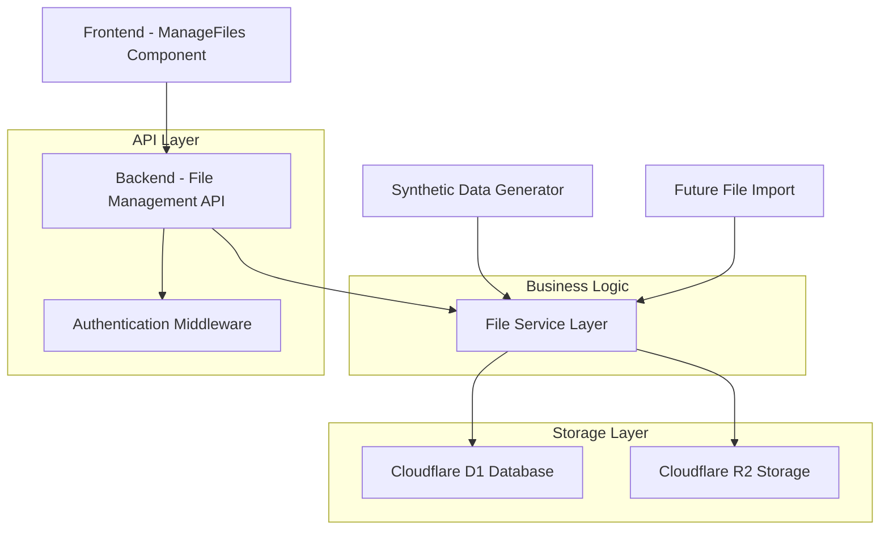

# Design Document

## Overview

The file management feature provides logged-in users with a centralized interface to manage CSV files they have created within Cutty. This system builds upon the existing file storage infrastructure using Cloudflare R2 and the D1 database, extending the current synthetic data generation workflow to include comprehensive file management capabilities.

The design leverages the existing `files` table in the database and the established R2 storage patterns, while introducing a new dedicated frontend component and enhanced backend endpoints for file management operations.

## Architecture

### High-Level Architecture



### Component Integration

The file management system integrates with existing components:

- **Existing Files Routes**: Extends `/api/v1/files` endpoints with enhanced list functionality
- **Synthetic Data Generator**: Files created through synthetic data generation are automatically available in file management
- **Authentication System**: Leverages existing JWT-based authentication
- **Navigation**: Integrates with the existing "Files" navigation group in the sidebar

## Components and Interfaces

### Frontend Components

#### ManageFiles Component (`app/frontend/src/components/ManageFiles.jsx`)

**Purpose**: Main interface for file management operations

**Key Features**:
- File list display with sortable columns (name, size, creation date)
- Download and delete actions for each file
- Empty state handling
- Loading states and error handling
- Responsive design using Material-UI

**State Management**:
```javascript
const [files, setFiles] = useState([]);
const [loading, setLoading] = useState(true);
const [error, setError] = useState(null);
const [deleteConfirm, setDeleteConfirm] = useState(null);
```

**API Integration**:
- `GET /api/v1/files` - Fetch user's files
- `GET /api/v1/files/:fileId` - Download file
- `DELETE /api/v1/files/:fileId` - Delete file

### Backend API Endpoints

#### Enhanced File List Endpoint

**Endpoint**: `GET /api/v1/files`

**Enhancements**:
- Filter by file type (CSV only for MVP)
- Enhanced metadata in response
- Improved error handling

**Response Format**:
```json
{
  "success": true,
  "files": [
    {
      "id": "uuid",
      "filename": "synthetic-voter-data-100-records.csv",
      "size": 12345,
      "mimeType": "text/csv",
      "createdAt": "2025-01-20T10:30:00Z",
      "source": "synthetic-data"
    }
  ],
  "pagination": {
    "total": 1,
    "limit": 50,
    "offset": 0
  }
}
```

#### File Download Endpoint

**Endpoint**: `GET /api/v1/files/:fileId`

**Current Implementation**: Already exists, will be enhanced for better error handling

**Security**: Validates user ownership before serving file

#### File Delete Endpoint

**Endpoint**: `DELETE /api/v1/files/:fileId`

**Current Implementation**: Already exists, will be enhanced for better error handling

**Operations**:
1. Validate user ownership
2. Delete from R2 storage
3. Remove database record
4. Return success confirmation

### Service Layer

#### File Management Service

**Purpose**: Centralized business logic for file operations

**Key Methods**:
- `getUserFiles(userId, options)` - Retrieve user's files with filtering
- `deleteUserFile(userId, fileId)` - Safely delete user's file
- `validateFileOwnership(userId, fileId)` - Verify user owns file

## Data Models

### Database Schema

The system uses the existing `files` table with the following relevant columns:

```sql
CREATE TABLE files (
  id TEXT PRIMARY KEY,
  user_id TEXT NOT NULL,
  filename TEXT NOT NULL,
  original_filename TEXT,
  file_size INTEGER NOT NULL,
  mime_type TEXT NOT NULL,
  r2_key TEXT NOT NULL,
  upload_status TEXT DEFAULT 'completed',
  created_at TEXT DEFAULT CURRENT_TIMESTAMP,
  tags TEXT, -- JSON array for categorization
  -- Additional columns for metadata
  FOREIGN KEY (user_id) REFERENCES users(id)
);
```

**Key Indexes** (already exist):
- `idx_files_user_id` - For efficient user file queries
- `idx_files_created_at` - For chronological sorting
- `idx_files_r2_key` - For R2 operations

### R2 Storage Structure

**File Key Pattern**: `files/{userId}/{fileId}/{filename}`

**Synthetic Data Pattern**: `synthetic-data/{userId}/{fileId}/{filename}`

**Metadata Storage**: Custom metadata stored in R2 object headers
- `userId` - File owner
- `originalName` - Original filename
- `size` - File size in bytes
- `uploadedAt` - Upload timestamp
- `type` - File category (e.g., "synthetic-data")

## Error Handling

### Frontend Error Handling

**Error Categories**:
1. **Network Errors**: Connection failures, timeouts
2. **Authentication Errors**: Invalid/expired tokens
3. **Authorization Errors**: Attempting to access files not owned
4. **File Not Found**: Requested file doesn't exist
5. **Storage Errors**: R2 operation failures

**Error Display Strategy**:
- Toast notifications for transient errors
- Inline error messages for form validation
- Empty state with error message for list failures
- Confirmation dialogs for destructive operations

### Backend Error Handling

**Error Response Format**:
```json
{
  "error": "Error type",
  "message": "User-friendly error message",
  "details": ["Specific error details"],
  "code": "ERROR_CODE"
}
```

**Error Logging**:
- All errors logged to console with context
- Security events logged to audit trail
- Performance metrics tracked for monitoring

## Testing Strategy

### Unit Tests

**Frontend Tests** (`ManageFiles.test.jsx`):
- Component rendering with different states
- User interaction handling (download, delete)
- Error state display
- Loading state behavior

**Backend Tests** (`file-management.test.ts`):
- API endpoint functionality
- Authentication/authorization validation
- Error handling scenarios
- Database operations

### Integration Tests

**End-to-End Tests**:
- Complete file management workflow
- File creation through synthetic data → management
- Cross-browser compatibility
- Mobile responsiveness

**API Integration Tests**:
- File list retrieval with various filters
- Download functionality with different file types
- Delete operations with cleanup verification

### Test Data Strategy

**Test File Generation**:
- Small CSV files for quick tests
- Various file sizes for performance testing
- Files with different metadata for filtering tests

**Database Test Data**:
- Multiple users with different file sets
- Files in various states (completed, processing, error)
- Edge cases (empty files, special characters in names)

## Security Considerations

### Authentication & Authorization

**User Verification**:
- JWT token validation on all endpoints
- User ID extraction from validated token
- File ownership verification before operations

**Access Control**:
- Users can only see/manage their own files
- No cross-user file access possible
- Admin users (future) may have broader access

### Data Protection

**File Storage Security**:
- R2 objects not publicly accessible
- Signed URLs for downloads (if needed in future)
- Secure deletion ensuring no data remnants

**Input Validation**:
- File ID format validation (UUID)
- File type restrictions (CSV only for MVP)
- Size limits enforced

## Performance Considerations

### Frontend Performance

**Optimization Strategies**:
- Lazy loading of file list
- Pagination for large file sets
- Debounced search/filter operations
- Efficient re-rendering with React keys

### Backend Performance

**Database Optimization**:
- Efficient queries using existing indexes
- Pagination to limit result sets
- Connection pooling for D1

**R2 Operations**:
- Streaming downloads for large files
- Batch operations where possible
- Proper error handling for R2 timeouts

### Caching Strategy

**Frontend Caching**:
- File list cached in component state
- Invalidation on successful operations
- Optimistic updates for better UX

**Backend Caching**:
- File metadata caching in KV (future enhancement)
- R2 object metadata caching
- Cache invalidation on file operations

## Future Enhancements

### Post-MVP Features

**File Preview**:
- CSV content preview in modal
- Column header display
- Row count and basic statistics

**Advanced File Management**:
- File renaming capability
- File tagging and categorization
- Bulk operations (delete multiple files)

**File Import**:
- Direct CSV file upload
- File validation and processing
- Import history tracking

### Scalability Considerations

**Large File Sets**:
- Virtual scrolling for file lists
- Advanced filtering and search
- File archiving for old files

**Multi-tenant Support**:
- Organization-level file sharing
- Role-based access control
- File collaboration features