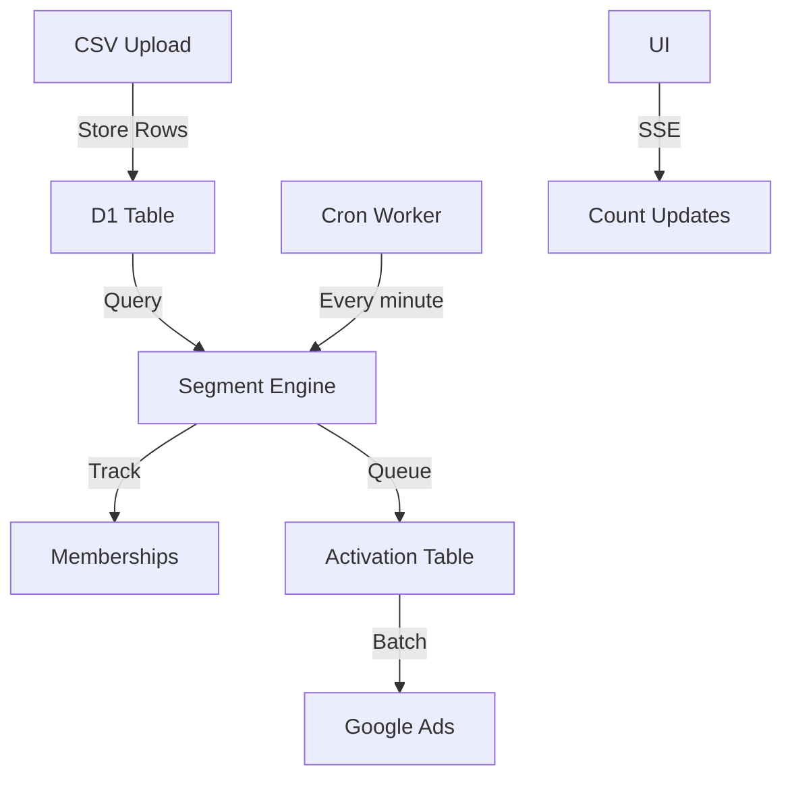

# Design Document - Segmentation MVP

## Overview

Fast-track implementation of dynamic segmentation that proves the concept without over-engineering. Uses D1's SQL capabilities for incremental processing instead of complex event systems.

## Architecture

### Simplified Architecture



## Key Design Decisions

### 1. D1 as Truth Source
Instead of processing CSVs on-demand, store all data in D1:
- Enables SQL queries for segmentation
- Timestamp tracking for incremental updates  
- Indexes for performance
- No need for complex streaming

### 2. Simple Incremental Processing
```typescript
// The entire "real-time" system in 50 lines
export async function processSegments(env: Env) {
  const db = env.DB;
  
  // Get segments that need processing
  const segments = await db.prepare(`
    SELECT * FROM segments 
    WHERE datetime(last_processed) < datetime('now', '-1 minute')
    OR last_processed IS NULL
  `).all();
  
  for (const segment of segments.results) {
    const query = JSON.parse(segment.query);
    const whereClause = buildWhereClause(query);
    
    // Find new/updated records matching segment
    const matches = await db.prepare(`
      SELECT id, data FROM csv_data
      WHERE file_id = ?
      AND datetime(updated_at) > datetime(?)  
      AND ${whereClause}
    `).bind(
      segment.file_id,
      segment.last_processed || '1970-01-01'
    ).all();
    
    // Update memberships
    if (matches.results.length > 0) {
      const batch = matches.results.map(r => 
        `('${segment.id}', '${r.id}')`
      ).join(',');
      
      await db.prepare(`
        INSERT OR IGNORE INTO segment_members (segment_id, record_id)
        VALUES ${batch}
      `).run();
      
      // Queue for activation
      if (segment.google_ads_list_id) {
        await db.prepare(`
          INSERT INTO activation_queue (segment_id, record_ids, platform)
          VALUES (?, ?, 'google_ads')
        `).bind(
          segment.id,
          JSON.stringify(matches.results.map(r => r.id))
        ).run();
      }
    }
    
    // Update last processed time
    await db.prepare(`
      UPDATE segments 
      SET last_processed = datetime('now'),
          member_count = (
            SELECT COUNT(*) FROM segment_members 
            WHERE segment_id = ?
          )
      WHERE id = ?
    `).bind(segment.id, segment.id).run();
  }
}
```

### 3. Google Ads Activation
```typescript
export async function processActivationQueue(env: Env) {
  const db = env.DB;
  
  // Get pending activations
  const pending = await db.prepare(`
    SELECT * FROM activation_queue 
    WHERE status = 'pending' 
    LIMIT 100
  `).all();
  
  // Group by segment for efficient API calls
  const bySegment = groupBy(pending.results, 'segment_id');
  
  for (const [segmentId, items] of Object.entries(bySegment)) {
    const segment = await getSegment(db, segmentId);
    const allRecordIds = items.flatMap(i => JSON.parse(i.record_ids));
    
    // Get record data
    const records = await db.prepare(`
      SELECT data FROM csv_data 
      WHERE id IN (${allRecordIds.map(() => '?').join(',')})
    `).bind(...allRecordIds).all();
    
    // Upload to Google Ads
    try {
      await uploadToGoogleAds(
        segment.google_ads_customer_id,
        segment.google_ads_list_id,
        records.results.map(r => JSON.parse(r.data))
      );
      
      // Mark as processed
      await db.prepare(`
        UPDATE activation_queue 
        SET status = 'completed' 
        WHERE id IN (${items.map(() => '?').join(',')})
      `).bind(...items.map(i => i.id)).run();
      
    } catch (error) {
      console.error('Activation failed:', error);
      // Mark as failed for retry
      await db.prepare(`
        UPDATE activation_queue 
        SET status = 'failed' 
        WHERE id IN (${items.map(() => '?').join(',')})
      `).bind(...items.map(i => i.id)).run();
    }
  }
}
```

### 4. UI Updates via Server-Sent Events
```typescript
// Simple endpoint for live count updates
export async function handleSSE(request: Request, env: Env): Promise<Response> {
  const db = env.DB;
  const encoder = new TextEncoder();
  
  const stream = new ReadableStream({
    async start(controller) {
      // Send counts every 10 seconds
      const interval = setInterval(async () => {
        const segments = await db.prepare(`
          SELECT id, name, member_count, last_processed 
          FROM segments
        `).all();
        
        const data = encoder.encode(
          `data: ${JSON.stringify(segments.results)}\n\n`
        );
        controller.enqueue(data);
      }, 10000);
      
      // Cleanup on close
      request.signal.addEventListener('abort', () => {
        clearInterval(interval);
        controller.close();
      });
    }
  });
  
  return new Response(stream, {
    headers: {
      'Content-Type': 'text/event-stream',
      'Cache-Control': 'no-cache',
      'Connection': 'keep-alive',
    },
  });
}
```

## Implementation Details

### CSV Upload Changes
```typescript
// Modify existing upload to store in D1
async function handleCSVUpload(file: File, env: Env) {
  const fileId = crypto.randomUUID();
  const db = env.DB;
  
  // Store file metadata
  await db.prepare(`
    INSERT INTO files (id, name, size, user_id)
    VALUES (?, ?, ?, ?)
  `).bind(fileId, file.name, file.size, userId).run();
  
  // Parse and store rows
  const text = await file.text();
  const rows = parseCSV(text);
  const headers = rows[0];
  
  // Batch insert rows
  const BATCH_SIZE = 1000;
  for (let i = 1; i < rows.length; i += BATCH_SIZE) {
    const batch = rows.slice(i, i + BATCH_SIZE);
    const values = batch.map(row => {
      const data = Object.fromEntries(
        headers.map((h, idx) => [h, row[idx]])
      );
      return `('${crypto.randomUUID()}', '${fileId}', '${JSON.stringify(data)}')`;
    }).join(',');
    
    await db.prepare(`
      INSERT INTO csv_data (id, file_id, data)
      VALUES ${values}
    `).run();
  }
  
  return fileId;
}
```

### Query Builder
```typescript
// Convert UI query to SQL WHERE clause
function buildWhereClause(query: SegmentQuery): string {
  const conditions = query.conditions.map(cond => {
    const jsonPath = `json_extract(data, '$.${cond.field}')`;
    
    switch (cond.operator) {
      case 'equals':
        return `${jsonPath} = '${cond.value}'`;
      case 'contains':
        return `${jsonPath} LIKE '%${cond.value}%'`;
      case 'greater_than':
        return `CAST(${jsonPath} AS REAL) > ${cond.value}`;
      case 'less_than':
        return `CAST(${jsonPath} AS REAL) < ${cond.value}`;
      case 'is_empty':
        return `${jsonPath} IS NULL OR ${jsonPath} = ''`;
      default:
        throw new Error(`Unknown operator: ${cond.operator}`);
    }
  });
  
  return conditions.join(` ${query.logic} `);
}
```

### Cron Triggers
```toml
# wrangler.toml
[triggers]
crons = ["* * * * *"]  # Every minute

# In worker
export default {
  async scheduled(event: ScheduledEvent, env: Env) {
    await processSegments(env);
    await processActivationQueue(env);
  }
};
```

## Performance Considerations

### D1 Limits & Optimizations
- Max 10GB per database (millions of rows)
- Create indexes on queried fields
- Use PRAGMA for performance tuning
- Batch operations when possible

### Query Performance
```sql
-- Essential indexes
CREATE INDEX idx_csv_file_updated ON csv_data(file_id, updated_at);
CREATE INDEX idx_csv_json_state ON csv_data(json_extract(data, '$.state'));
CREATE INDEX idx_members_segment ON segment_members(segment_id);
```

## Why This Architecture Works

1. **Simplicity**: No Durable Objects, queues, or complex systems
2. **Incremental**: Timestamp-based processing is bulletproof
3. **Scalable Enough**: D1 handles millions of rows fine
4. **Fast Development**: Use SQL instead of building systems
5. **Demo Ready**: Shows real value immediately

## Testing Approach

```typescript
// Simple integration test
test('segment processes incrementally', async () => {
  // Insert test data
  await db.prepare(`
    INSERT INTO csv_data (id, file_id, data, updated_at)
    VALUES ('1', 'file1', '{"state":"CA","value":100}', datetime('now'))
  `).run();
  
  // Create segment
  await db.prepare(`
    INSERT INTO segments (id, file_id, query)
    VALUES ('seg1', 'file1', '{"conditions":[{"field":"state","operator":"equals","value":"CA"}],"logic":"AND"}')
  `).run();
  
  // Process segments
  await processSegments({ DB: db });
  
  // Check membership
  const members = await db.prepare(`
    SELECT * FROM segment_members WHERE segment_id = 'seg1'
  `).all();
  
  expect(members.results).toHaveLength(1);
});
```

## Migration from This to Full Spec 2

Once this MVP works:

1. **Add Durable Objects**: For distributed processing
2. **Implement WebSockets**: Replace SSE
3. **Add more platforms**: Facebook, TikTok
4. **Build proper queue**: Replace simple table
5. **Add change streams**: Replace timestamp polling

But first, ship this and prove the value!