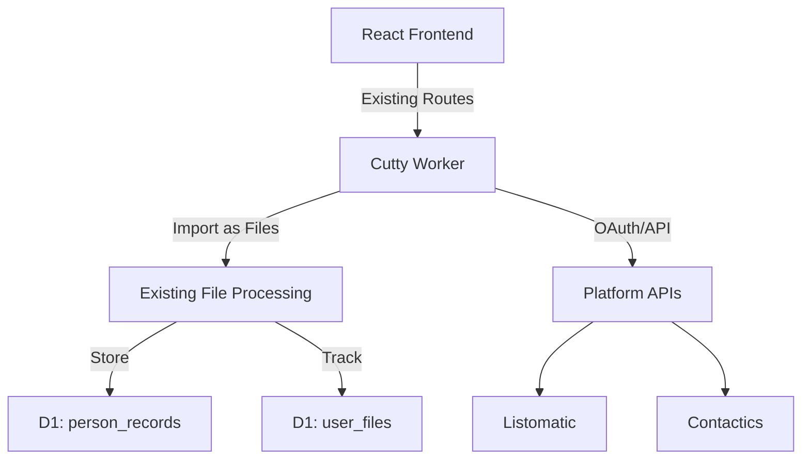

# Design Document - Simple Platform Data Import

## Overview

This feature adds automated import capabilities to Cutty, allowing users to pull voter data directly from Listomatic and Contactics without manual CSV exports. The design maximizes reuse of Cutty's existing infrastructure, treating platform imports as enhanced file uploads.

## Architecture

### Simplified Architecture



### Key Simplifications
- **Treat imports as files** - Platform imports create "virtual files" in existing system
- **Reuse file processing** - Imported data flows through existing CSV pipeline
- **Minimal new tables** - Only add `platform_connections` table
- **No new UI paradigm** - Platform sync appears in file management UI
- **Leverage existing patterns** - Auth, errors, logging all remain unchanged

## Components

### Frontend Components (Minimal Changes)

#### Enhanced ManageFiles Component
- **Location**: `app/frontend/src/components/ManageFiles.jsx` (existing)
- **Changes**: Add platform sync section
- **New Features**:
  - "Connect Platform" button
  - Platform status badges
  - Sync now action
  - Last sync timestamp

#### PlatformConnect Modal
- **Location**: `app/frontend/src/components/PlatformConnect.jsx` (new)
- **Purpose**: Simple OAuth/API key setup
- **Size**: ~100 lines
- **Features**:
  - Platform selector (Listomatic, Contactics)
  - OAuth flow or API key input
  - Test connection button

### Backend Changes (Minimal)

#### Extended Files Route
- **Location**: `cloudflare/workers/src/routes/files.ts` (existing)
- **New Endpoints**:
  - `POST /api/v1/files/platform-connect` - Setup platform connection
  - `POST /api/v1/files/platform-sync` - Trigger manual sync
  - `GET /api/v1/files/platform-status` - Get sync status

#### Cron Handler
- **Location**: Add to `cloudflare/workers/src/index.ts`
- **Schedule**: Every 15 minutes
- **Logic**: 
  ```typescript
  // Simple cron handler
  app.on('scheduled', async (event, env, ctx) => {
    ctx.waitUntil(syncPlatforms(env));
  });
  ```

## Data Models

### Database Schema (Minimal Additions)

```sql
-- Single new table for platform connections
CREATE TABLE platform_connections (
  id TEXT PRIMARY KEY,
  user_id TEXT NOT NULL,
  platform TEXT NOT NULL, -- 'listomatic' or 'contactics'
  credentials TEXT NOT NULL, -- Encrypted OAuth token or API key
  last_sync_at DATETIME,
  last_sync_file_id TEXT, -- Links to user_files table
  status TEXT DEFAULT 'active',
  created_at DATETIME DEFAULT CURRENT_TIMESTAMP,
  FOREIGN KEY (user_id) REFERENCES users(id),
  FOREIGN KEY (last_sync_file_id) REFERENCES user_files(id)
);

-- Reuse existing tables:
-- * person_records - Store imported voter data
-- * user_files - Track each sync as a "virtual file"
-- * file_processing_logs - Use for sync status

-- Add metadata column to person_records for voter-specific data
ALTER TABLE person_records ADD COLUMN metadata TEXT; -- JSON for extra fields
ALTER TABLE person_records ADD COLUMN source_platform TEXT; -- 'listomatic', 'contactics', or NULL
```

### API Data Models (Minimal)

```typescript
// Platform connection
interface PlatformConnection {
  id: string;
  platform: 'listomatic' | 'contactics';
  lastSyncAt?: string;
  status: 'active' | 'error' | 'syncing';
}

// Extend existing PersonRecord type
interface PersonRecordMetadata {
  // Listomatic fields
  engagementScore?: number;
  segments?: string[];
  listMembership?: string[];
  
  // Contactics fields
  interactionCount?: number;
  lastInteractionType?: string;
  contactPreference?: 'email' | 'sms' | 'phone';
  activityTimeline?: Array<{date: string; type: string}>;
}

// Sync creates a "virtual file"
interface PlatformSyncFile {
  id: string;
  fileName: string; // e.g., "Listomatic Import - 2024-01-15"
  platform: string;
  recordCount: number;
  status: 'processing' | 'completed' | 'failed';
}
```

## Implementation Details

### Simple Platform Integration

```typescript
// Platform sync as file import
async function syncPlatform(connection: PlatformConnection, env: Env) {
  // 1. Create virtual file entry
  const file = await createVirtualFile(connection.userId, {
    fileName: `${connection.platform} Import - ${new Date().toISOString()}`,
    type: 'platform_sync',
    platform: connection.platform
  });

  // 2. Fetch data from platform
  const adapter = getPlatformAdapter(connection.platform);
  const records = await adapter.fetchRecords(connection.credentials);

  // 3. Convert to CSV format in memory
  const csvData = convertToCSV(records);

  // 4. Process through existing CSV pipeline
  await processCSV(file.id, csvData, env);

  // 5. Update connection last sync
  await updateLastSync(connection.id, file.id);
}
```

### Platform API Schemas

#### Listomatic API Response
```json
{
  "members": [
    {
      "id": "LST-12345",
      "full_name": "Jane Smith",
      "email_address": "jane.smith@example.com",
      "primary_phone": "+1-555-0123",
      "location": {
        "city": "Austin",
        "state": "TX",
        "postal_code": "78701"
      },
      "engagement_score": 85,
      "segments": ["high-value", "frequent-donor", "volunteer"],
      "lists": [
        {"id": "L1", "name": "2024 Donors"},
        {"id": "L2", "name": "Austin Volunteers"}
      ],
      "created_at": "2023-01-15T10:30:00Z",
      "updated_at": "2024-01-20T15:45:00Z"
    }
  ]
}
```

#### Contactics API Response
```json
{
  "data": [
    {
      "contact_id": "CTX-98765",
      "first_name": "John",
      "last_name": "Doe",
      "primary_email": "john.doe@example.com",
      "mobile_phone": "+1-555-0456",
      "landline_phone": "+1-555-7890",
      "address": {
        "street": "123 Main St",
        "city": "Denver",
        "state_code": "CO",
        "zip": "80202"
      },
      "total_interactions": 23,
      "last_interaction": {
        "type": "email_opened",
        "timestamp": "2024-01-19T09:15:00Z"
      },
      "preferred_channel": "email",
      "timeline": [
        {"date": "2024-01-19", "type": "email_opened"},
        {"date": "2024-01-15", "type": "form_submitted"},
        {"date": "2024-01-10", "type": "donation_made"}
      ]
    }
  ]
}
```

### Platform Adapters (Minimal)

```typescript
// Listomatic Adapter - List management focus
class ListomaticAdapter {
  async fetchRecords(apiKey: string, since?: Date) {
    const response = await fetch('https://api.listomatic.io/v2/members', {
      headers: { 'X-API-Key': apiKey },
      params: { updated_since: since?.toISOString() }
    });
    
    return response.members.map(m => ({
      // Parse compound name
      firstName: m.full_name.split(' ')[0],
      lastName: m.full_name.split(' ').slice(1).join(' '),
      email: m.email_address,
      phone: m.primary_phone,
      city: m.location?.city,
      state: m.location?.state,
      metadata: {
        engagementScore: m.engagement_score,
        segments: m.segments,
        listMembership: m.lists.map(l => l.name)
      }
    }));
  }
}

// Contactics Adapter - Interaction focus
class ContacticsAdapter {
  async fetchRecords(token: string, since?: Date) {
    const response = await fetch('https://api.contactics.com/contacts/export', {
      headers: { 'Authorization': `Bearer ${token}` },
      body: JSON.stringify({ 
        modified_after: since?.toISOString(),
        include_timeline: true 
      })
    });
    
    return response.data.map(c => ({
      firstName: c.first_name,
      lastName: c.last_name,
      email: c.primary_email,
      phone: c.mobile_phone || c.landline_phone,
      city: c.address?.city,
      state: c.address?.state_code,
      metadata: {
        interactionCount: c.total_interactions,
        lastInteractionType: c.last_interaction?.type,
        contactPreference: c.preferred_channel,
        activityTimeline: c.timeline?.slice(0, 10) // Last 10 activities
      }
    }));
  }
}
```

### Performance & Reliability

- **Chunked Processing**: Import in batches of 1000 records
- **Use Existing Rate Limits**: Cutty's existing rate limiting applies
- **Simple Retry**: Use fetch with retry (3 attempts)
- **Progress Tracking**: Update file_processing_logs table

## Security (Using Existing Patterns)

- **Credentials**: Encrypt with Web Crypto API (like existing OAuth)
- **Auth**: All endpoints require JWT (existing middleware)
- **Validation**: Zod schemas (existing pattern)
- **Rate Limiting**: 10 syncs/hour per user
- **Logging**: Use existing audit patterns

## Testing Approach

- **Mock Platform APIs**: Use existing test patterns
- **Test CSV Conversion**: Verify data mapping
- **Integration Tests**: Full sync flow with mocked APIs
- **Manual Testing**: Connect real platforms in dev environment

## Implementation Steps

### Week 1: Foundation
1. Add `platform_connections` table migration
2. Create platform adapters (Listomatic first)
3. Add sync endpoints to files route
4. Implement cron handler

### Week 2: UI & Polish
1. Add platform section to ManageFiles
2. Create PlatformConnect modal
3. Test with real platform data
4. Add error handling and retries

## Key Benefits of Simplified Design

1. **Minimal Code Changes** - ~500 lines total vs thousands
2. **Reuses Everything** - File processing, auth, UI patterns
3. **No New Paradigms** - Platform sync is just another file type
4. **Fast Implementation** - 2 weeks vs 4-6 weeks
5. **Easy to Maintain** - Follows existing Cutty patterns
6. **Lower Risk** - Changes are additive, not structural

## Success Metrics

- Implementation time: < 2 weeks
- New code: < 500 lines
- User training: < 5 minutes
- Performance impact: Negligible

## Future Considerations

Only if users request:
- More platforms (easy to add adapters)
- Custom field mapping
- Real-time sync
- Duplicate management UI

The design philosophy: Treat platform imports as enhanced file uploads, maximizing reuse of Cutty's proven infrastructure.