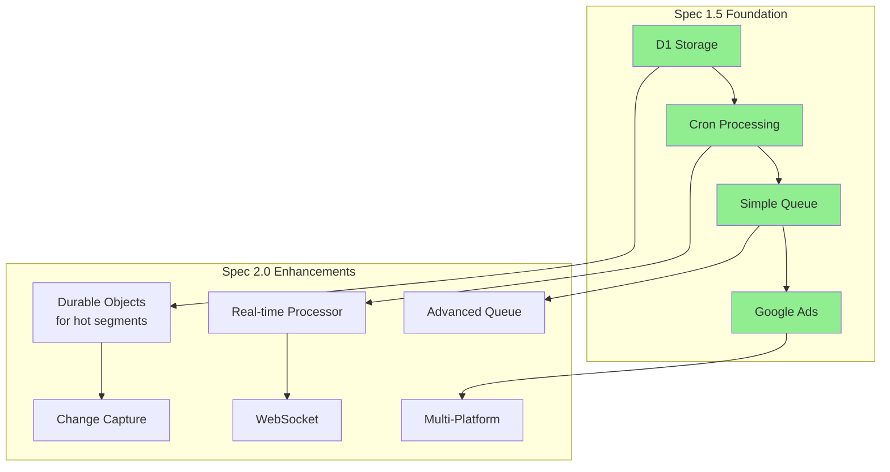

# Design Document - Dynamic Segmentation Engine 2.0

## Overview

Building on the proven foundation of Spec 1.5's D1-based segmentation, this design adds enterprise-scale performance, multi-platform activation, and true real-time capabilities while maintaining backward compatibility.

## Prerequisites

This spec assumes Spec 1.5 is fully implemented:
- CSV data stored in D1 with timestamps
- Basic segmentation with cron-based updates
- Google Ads activation working
- Server-Sent Events for UI updates

## Architecture

### Evolution from 1.5 Architecture



### Key Design Principles (Building on 1.5)
- **Hybrid architecture** - Keep D1 for storage, add Durable Objects for performance
- **Progressive enhancement** - Cron still works, real-time is additive
- **Backward compatible** - All 1.5 APIs continue to function
- **Selective optimization** - Only hot segments use advanced features
- **Gradual migration** - Move segments to DO based on usage patterns

## Components

### Frontend

#### SegmentBuilder Component
- **Location**: `app/frontend/src/components/segments/SegmentBuilder.jsx`
- **Purpose**: Visual query builder interface
- **Size**: ~500-600 lines
- **Features**:
  - Drag-and-drop condition builder
  - Field selector with operators
  - AND/OR/NOT logic groups
  - Real-time count preview
  - Save/load segment definitions

#### SegmentList Component
- **Location**: `app/frontend/src/components/segments/SegmentList.jsx`
- **Purpose**: Manage saved segments with live updates
- **Size**: ~300-400 lines
- **Features**:
  - Real-time segment counts via WebSocket
  - Platform activation status indicators
  - Quick actions (edit, duplicate, delete)
  - Sync history and performance metrics

#### ActivationManager Component
- **Location**: `app/frontend/src/components/segments/ActivationManager.jsx`
- **Purpose**: Configure and monitor platform syncs
- **Size**: ~400-500 lines
- **Features**:
  - Platform connection setup (OAuth flows)
  - Field mapping configuration
  - Sync frequency settings
  - Real-time sync status and errors

### Backend

#### Segment Routes
- **Location**: `cloudflare/workers/src/routes/segments.ts`
- **Endpoints**:
  - `GET /api/v1/segments` - List user's segments with live counts
  - `POST /api/v1/segments` - Create new segment (triggers initial population)
  - `GET /api/v1/segments/:id` - Get segment details
  - `PUT /api/v1/segments/:id` - Update segment (triggers re-evaluation)
  - `DELETE /api/v1/segments/:id` - Delete segment
  - `POST /api/v1/segments/:id/preview` - Preview segment results
  - `WS /api/v1/segments/subscribe` - WebSocket for live updates
  
#### Activation Routes
- **Location**: `cloudflare/workers/src/routes/activation.ts`
- **Endpoints**:
  - `POST /api/v1/activation/configure` - Set up platform sync
  - `GET /api/v1/activation/:segmentId/status` - Get sync status
  - `POST /api/v1/activation/:segmentId/sync` - Trigger manual sync
  - `DELETE /api/v1/activation/:segmentId` - Disable activation

#### Segment Processor (Durable Object)
- **Location**: `cloudflare/workers/src/do/SegmentProcessor.ts`
- **Purpose**: Real-time segment evaluation
- **Features**:
  - Incremental membership updates
  - Change event processing
  - Activation queue management
  - Distributed state management

#### Activation Worker
- **Location**: `cloudflare/workers/src/workers/ActivationWorker.ts`
- **Purpose**: Sync segments to ad platforms
- **Features**:
  - Batch processing for efficiency
  - Platform-specific API integration
  - Retry logic and error handling
  - Rate limit management

## Migration Strategy from 1.5

### Keeping What Works
1. **D1 remains primary storage** - No data migration needed
2. **Existing cron jobs continue** - Add real-time alongside
3. **Simple queue table stays** - Advanced queue handles scale
4. **All 1.5 APIs work** - New features are additive

### Progressive Enhancement Pattern
```typescript
// 1.5 cron job continues to run
export async function scheduled(event) {
  await processSegments(env); // Existing 1.5 logic
  
  // New: Also trigger real-time for hot segments
  const hotSegments = await getHotSegments(env.DB);
  for (const segment of hotSegments) {
    await env.SEGMENT_DO.get(segment.id).fetch('/process');
  }
}

// Gradual migration based on usage
async function shouldUseRealtimeProcessing(segment) {
  return segment.member_count < 100000 
    && segment.update_frequency > 10; // updates/hour
}
```

## Data Models

### Segment Definition
```typescript
interface Segment {
  id: string;
  user_id: string;
  file_id: string; // Reference to uploaded CSV file
  name: string;
  description?: string;
  query: SegmentQuery;
  tags?: string[];
  count?: number;
  last_calculated?: Date;
  created_at: Date;
  updated_at: Date;
}

interface SegmentQuery {
  conditions: Condition[];
  logic: 'AND' | 'OR';
}

interface Condition {
  field: string;
  operator: Operator;
  value: any;
  type?: 'group';
  conditions?: Condition[];
  logic?: 'AND' | 'OR' | 'NOT';
}

type Operator = 
  | 'equals' | 'not_equals' 
  | 'contains' | 'not_contains'
  | 'starts_with' | 'ends_with'
  | 'greater_than' | 'less_than' | 'between'
  | 'is_empty' | 'is_not_empty'
  | 'in_list' | 'not_in_list'
  | 'before' | 'after' | 'in_last_days';
```

### Database Schema (Additions to 1.5)
```sql
-- Existing 1.5 tables remain unchanged
-- csv_data, segments, segment_members, activation_queue

-- NEW: Add columns to existing segments table
ALTER TABLE segments ADD COLUMN processing_mode TEXT DEFAULT 'cron';
ALTER TABLE segments ADD COLUMN update_frequency INTEGER DEFAULT 0;
ALTER TABLE segments ADD COLUMN do_namespace TEXT; -- Durable Object ID

-- NEW: Change tracking for incremental updates (beyond timestamps)
CREATE TABLE IF NOT EXISTS data_changes (
  id TEXT PRIMARY KEY DEFAULT (lower(hex(randomblob(16)))),
  file_id TEXT NOT NULL,
  record_id TEXT NOT NULL,
  operation TEXT NOT NULL CHECK(operation IN ('insert', 'update', 'delete')),
  old_data TEXT, -- JSON
  new_data TEXT, -- JSON
  changed_at DATETIME DEFAULT CURRENT_TIMESTAMP,
  processed BOOLEAN DEFAULT false,
  FOREIGN KEY (file_id) REFERENCES files(id)
);

-- NEW: Multi-platform activation (extends simple activation_queue)
CREATE TABLE IF NOT EXISTS segment_activations (
  id TEXT PRIMARY KEY DEFAULT (lower(hex(randomblob(16)))),
  segment_id TEXT NOT NULL,
  platform TEXT NOT NULL CHECK(platform IN ('google_ads', 'facebook', 'tiktok')),
  destination_id TEXT NOT NULL, -- Platform-specific list/audience ID
  field_mapping TEXT NOT NULL, -- JSON mapping
  sync_frequency TEXT DEFAULT 'realtime',
  last_sync DATETIME,
  sync_status TEXT,
  created_at DATETIME DEFAULT CURRENT_TIMESTAMP,
  FOREIGN KEY (segment_id) REFERENCES segments(id) ON DELETE CASCADE
);

-- Indexes for performance
CREATE INDEX idx_segments_user_id ON segments(user_id);
CREATE INDEX idx_memberships_segment ON segment_memberships(segment_id, is_active);
CREATE INDEX idx_memberships_record ON segment_memberships(record_id);
CREATE INDEX idx_changes_unprocessed ON data_changes(file_id, processed);
CREATE INDEX idx_activations_segment ON segment_activations(segment_id);
```

## Implementation Details

### Hybrid Processing Strategy

```typescript
// Existing 1.5 processor continues to work
export async function processSegmentsCron(env: Env) {
  // ... existing 1.5 logic remains unchanged
}

// New: Durable Object for hot segments only
export class SegmentProcessor extends DurableObject {
  private segments: Map<string, CompiledSegment> = new Map();
  
  // Handle individual data changes
  async handleDataChange(change: DataChange) {
    const segments = await this.getSegmentsForFile(change.file_id);
    
    for (const segment of segments) {
      const wasMember = await this.checkMembership(
        segment.id, 
        change.record_id
      );
      
      const isMember = this.evaluateSegment(
        segment, 
        change.new_data
      );
      
      if (wasMember !== isMember) {
        await this.updateMembership(segment.id, change.record_id, isMember);
        await this.queueActivation({
          segment_id: segment.id,
          record_id: change.record_id,
          action: isMember ? 'add' : 'remove',
          data: change.new_data
        });
      }
    }
  }
  
  // Initial segment population
  async populateSegment(segmentId: string, fileId: string) {
    const segment = await this.loadSegment(segmentId);
    const stream = await this.env.R2.get(fileId).stream();
    
    let batch = [];
    for await (const row of this.parseCSVStream(stream)) {
      if (this.evaluateSegment(segment, row)) {
        batch.push({
          segment_id: segmentId,
          record_id: row.id || generateId(),
          data: row
        });
      }
      
      if (batch.length >= 1000) {
        await this.insertMembershipBatch(batch);
        await this.queueActivationBatch(batch);
        batch = [];
      }
    }
    
    if (batch.length > 0) {
      await this.insertMembershipBatch(batch);
      await this.queueActivationBatch(batch);
    }
  }
}
```

### Platform Activation Implementation

```typescript
export class ActivationWorker {
  async processActivationQueue() {
    const batch = await this.env.ACTIVATION_QUEUE.pullBatch({ max: 1000 });
    const grouped = this.groupByPlatformAndSegment(batch);
    
    for (const [key, changes] of grouped) {
      const { platform, segmentId } = this.parseKey(key);
      const config = await this.getActivationConfig(segmentId);
      
      try {
        switch (platform) {
          case 'google_ads':
            await this.syncToGoogleAds(config, changes);
            break;
          case 'facebook':
            await this.syncToFacebook(config, changes);
            break;
          case 'tiktok':
            await this.syncToTikTok(config, changes);
            break;
        }
        
        await this.updateSyncStatus(segmentId, 'success');
      } catch (error) {
        await this.handleSyncError(segmentId, error);
      }
    }
  }
  
  private async syncToGoogleAds(config: ActivationConfig, changes: Change[]) {
    const operations = changes.map(change => {
      const mapped = this.mapFields(change.data, config.field_mapping);
      return {
        [change.action]: {
          userIdentifiers: [{
            hashedEmail: this.hashSHA256(mapped.email),
            hashedPhoneNumber: this.hashSHA256(mapped.phone)
          }]
        }
      };
    });
    
    await fetch(`https://googleads.googleapis.com/v14/customers/${config.customer_id}/userLists/${config.destination_id}:mutateMembers`, {
      method: 'POST',
      headers: {
        'Authorization': `Bearer ${await this.getAccessToken('google_ads')}`,
        'Content-Type': 'application/json'
      },
      body: JSON.stringify({ operations })
    });
  }
}
```

## Performance Optimizations

### Progressive Performance Improvements
```typescript
// 1.5 Baseline: Cron every minute, full segment scan
// - 100K records: ~5 seconds per segment
// - Platform sync: 5 minutes via queue

// 2.0 for standard segments: Still use cron but smarter
// - Only scan changed records (updated_at index)
// - 100K records with 100 changes: ~200ms

// 2.0 for hot segments: Durable Objects
// - Real-time processing: 50-200ms per change
// - Platform sync: <5 seconds

// Decision logic
function getProcessingMode(segment) {
  if (segment.member_count > 1000000) return 'cron';
  if (segment.update_frequency < 5) return 'cron';
  return 'realtime';
}
```

## Security Considerations

### Query Validation
- Whitelist allowed fields based on user permissions
- Sanitize all inputs to prevent SQL injection
- Validate query depth to prevent DoS
- Rate limit query execution

### Data Access
- Segments scoped to user's organization
- Field-level permissions for sensitive data
- Audit logging for segment access
- Export controls for large datasets

## API Examples

### Create Segment with Activation
```http
POST /api/v1/segments
Authorization: Bearer {token}

{
  "file_id": "abc123",
  "name": "High-Value California Customers",
  "description": "Customers in CA with purchases > $500",
  "query": {
    "logic": "AND",
    "conditions": [
      {
        "field": "state",
        "operator": "equals",
        "value": "CA"
      },
      {
        "field": "total_purchases",
        "operator": "greater_than",
        "value": 500
      }
    ]
  },
  "activation": {
    "platform": "google_ads",
    "destination_id": "123456789",
    "sync_frequency": "realtime",
    "field_mapping": {
      "email": "email_address",
      "phone": "phone_number"
    }
  }
}
```

### WebSocket Subscription
```javascript
// Subscribe to real-time segment updates
const ws = new WebSocket('wss://cutty.com/api/v1/segments/subscribe');

ws.send(JSON.stringify({
  type: 'subscribe',
  segment_ids: ['seg_123', 'seg_456']
}));

ws.onmessage = (event) => {
  const { type, data } = JSON.parse(event.data);
  if (type === 'update') {
    console.log(`Segment ${data.segment_id}: ${data.count} members`);
  }
};
```

### Trigger Data Change
```http
POST /api/v1/files/{fileId}/records/{recordId}
Authorization: Bearer {token}

{
  "updates": {
    "state": "CA",
    "total_purchases": 750
  }
}

// This triggers:
// 1. Change event creation
// 2. Segment re-evaluation
// 3. Membership updates
// 4. Platform sync (if configured)
```

## Testing Strategy

### Unit Tests
```typescript
describe('QueryEngine', () => {
  it('should build simple equality query', () => {
    const query = {
      logic: 'AND',
      conditions: [{
        field: 'status',
        operator: 'equals',
        value: 'active'
      }]
    };
    
    const sql = engine.buildSQL(query, 'voters');
    expect(sql).toBe('SELECT * FROM voters WHERE status = ?');
  });
});
```

### Integration Tests
- Test segment CRUD operations
- Verify query execution against test data
- Validate caching behavior
- Test export functionality

## Implementation Phases

### Phase 1: Performance Optimization (Week 1)
1. Add indexes and processing_mode to existing tables
2. Optimize cron queries to use updated_at
3. Implement hot segment detection
4. Deploy Durable Objects for top 10% of segments

### Phase 2: Multi-Platform Support (Week 2)
1. Add Facebook Custom Audiences (building on Google Ads code)
2. Add TikTok integration
3. Unified activation dashboard
4. Platform-specific field mapping

### Phase 3: Real-time UI (Week 3)
1. Add WebSocket endpoint alongside SSE
2. Migrate hot segments to WebSocket updates
3. Keep SSE for backward compatibility

## Modern Architecture Benefits

### Real-time Capabilities Delivered
- **Instant Updates**: Segment membership changes in <100ms
- **Platform Activation**: Direct sync to Google, Meta, TikTok
- **Incremental Processing**: Only evaluate what changed
- **Live UI**: WebSocket updates show real-time counts
- **Event-Driven**: React to changes, don't poll

### Performance Characteristics
- **Initial Population**: Stream processing at 10K records/second
- **Change Processing**: 50-200ms per change event
- **Activation Sync**: <5 seconds to platform
- **WebSocket Updates**: <50ms latency
- **Horizontal Scale**: Durable Objects distribute load

### What This Enables
- **Campaign Agility**: "Purchased today" → In retargeting immediately
- **Reduced Manual Work**: No export/import cycles
- **Better Attribution**: Know exactly when users entered segments
- **Cost Efficiency**: Only sync changes, not entire lists
- **Compliance**: Honor opt-outs instantly

## Migration Benefits

### What 1.5 Proved
1. **D1 can handle segmentation** - SQL queries work great
2. **Cron is reliable** - Simple architecture that works
3. **Google Ads integration** - Platform activation is valuable
4. **Users want more** - Need for speed and scale

### What 2.0 Adds
1. **10x performance** - From minutes to milliseconds
2. **3x platforms** - Google, Facebook, TikTok
3. **Real-time UI** - Live updates feel magical
4. **Enterprise scale** - Handle millions of records
5. **Progressive enhancement** - Old stuff still works

## Key Success Factors

### Technical
- **No breaking changes** - 1.5 APIs continue working
- **Gradual migration** - Move hot segments first
- **Proven patterns** - Build on what works
- **Escape hatches** - Can always fall back to cron

### Product
- **Immediate value** - Performance improvements on day 1
- **Platform choice** - Users pick which platforms to activate
- **Cost control** - Only use DO for segments that need it
- **Clear upgrade path** - Users understand the benefits

The key principle: Evolution, not revolution. Build on the proven 1.5 foundation to deliver enterprise capabilities without a risky rewrite.