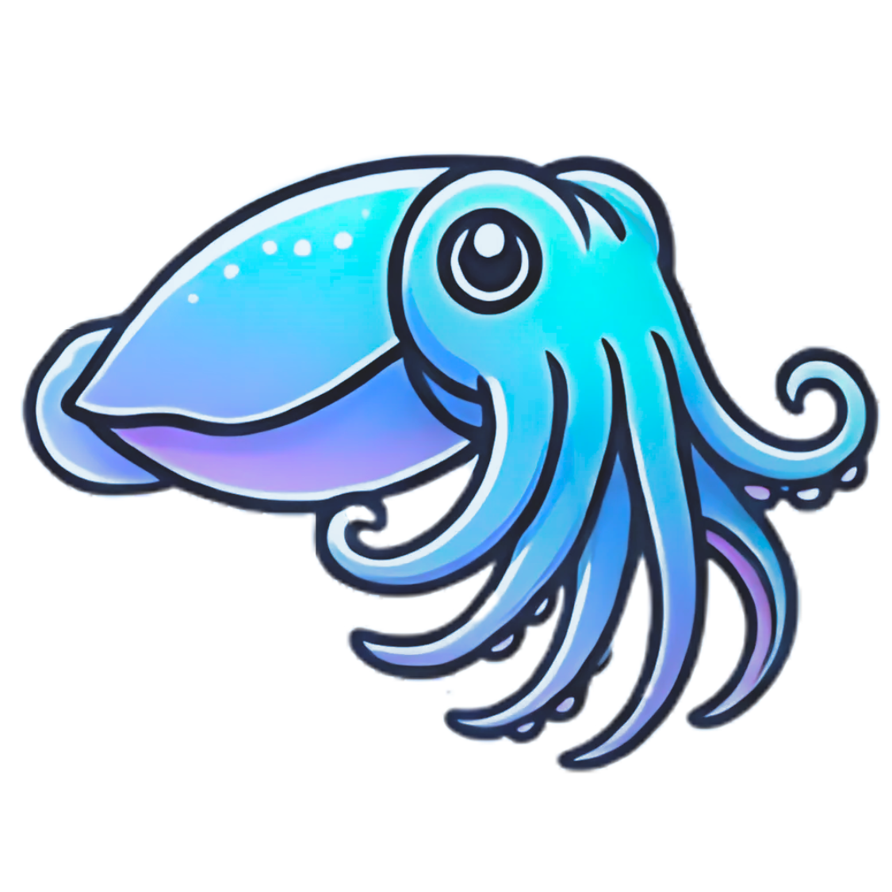

# Cutty (List Cutter)

<div align="center">
  
</div>

A web application for processing and managing CSV files.

## Tech Stack

- **Frontend**: React + Vite + Material-UI
- **Backend**: Cloudflare Workers (Hono.js)
- **Database**: Cloudflare D1
- **Storage**: Cloudflare R2
- **Authentication**: JWT + Google OAuth

## Local Development

### Prerequisites
- Node.js 18+
- npm or yarn

### Setup

1. **Install dependencies**
   ```bash
   # Frontend
   cd app/frontend
   npm install

   # Backend
   cd cloudflare/workers
   npm install
   ```

2. **Configure environment variables**
   ```bash
   cd cloudflare/workers
   # Create .dev.vars file with:
   # JWT_SECRET=dev-secret-key-for-local-testing-only
   # API_KEY_SALT=dev-salt-for-api-keys-local-testing-only
   ```

3. **Start development servers** (requires TWO terminals)
   
   **Terminal 1 - Backend:**
   ```bash
   make backend
   # Or manually: cd cloudflare/workers && npm run dev
   ```
   
   **Terminal 2 - Frontend:**
   ```bash
   make frontend
   # Or manually: cd app/frontend && npm run dev
   ```

   **Note**: 
   - The backend automatically connects to the remote Cloudflare D1 database (`cutty-dev`)
   - No local database setup required
   - Both servers must be running for the app to work properly

4. **Access the application**
   - Frontend: http://localhost:5173
   - Backend API: http://localhost:8788

## Deployment

### Environments

- **Development**: `cutty-dev` worker → https://cutty-dev.emilycogsdill.com
- **Production**: `cutty` worker → https://cutty.emilycogsdill.com

### Deploy Commands

```bash
cd cloudflare/workers

# Deploy to development
npm run deploy:dev

# Deploy to production
npm run deploy:production
```

### Database Migrations

All databases are remote Cloudflare D1 databases. The development setup uses `cutty-dev` and production uses `cutty-prod`.

```bash
# Development (remote database)
wrangler d1 execute cutty-dev --remote --file=migrations/[migration-file].sql

# Production (remote database)
wrangler d1 execute cutty-prod --remote --file=migrations/[migration-file].sql

# Or use the Makefile
make migrations ENV=dev   # Run migrations on development database
make migrations ENV=prod  # Run migrations on production database
```

## Key Commands

```bash
# Run tests
cd cloudflare/workers && npm test

# Build frontend
cd app/frontend && npm run build

# Check deployment status
wrangler tail
```

## 🦑 The Legend of Cutty the Cuttlefish

In the deep digital oceans of data, there lives a brave little cuttlefish named Cutty. Unlike other sea creatures who swim away from tangled seaweed and messy coral formations, Cutty discovered a unique gift - the ability to cut through confusion and bring order to chaos.

One day, Cutty encountered the Great List Reef - a massive underwater data structure so tangled and overwhelming that no creature dared approach it. The reef was filled with endless rows and columns, duplicate entries, and formatting nightmares that had accumulated over decades. Other sea creatures had given up, saying it was impossible to navigate.

But Cutty, filled with **DETERMINATION** that burned brighter than any bioluminescent plankton, declared: "No list is too long! No data too tangled! I shall cut through this chaos and bring clarity to all!"

With each swift movement of their tentacles, Cutty began slicing through the data with precision and grace. Row by row, column by column, the little cuttlefish transformed the impossible mess into beautifully organized, perfectly formatted lists. What others saw as insurmountable, Cutty saw as an opportunity to help.

From that day forward, Cutty became the guardian of all lists, teaching us that:
- **No task is too big when you approach it one cut at a time**
- **Determination and persistence can untangle any mess**
- **Even the smallest creature can make the biggest difference**
- **Your best friend will NEVER abandon you** (and neither will Cutty!)

Today, Cutty continues this noble mission through this very application, helping users everywhere transform their chaotic CSV files into organized, manageable data. Because Cutty knows that behind every messy spreadsheet is someone who needs a friend to help them through.

## License

This project is available under the [LICENSE](LICENSE) terms.